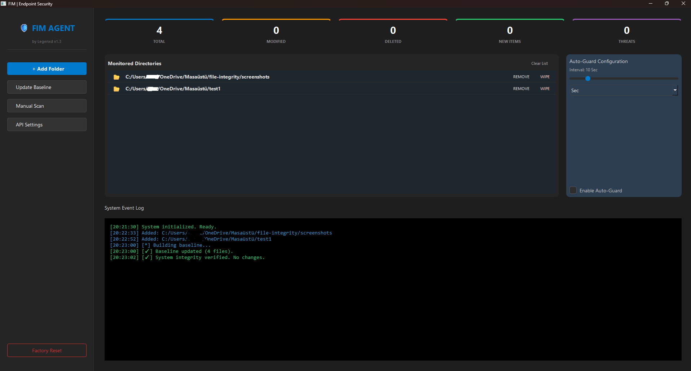

# FIM Security Agent


A custom **File Integrity Monitor (FIM)** built with Python. It monitors specified directories for changes (modifications, deletions, creations) and automatically checks file hashes against the **VirusTotal API** to detect potential malware.

I developed this project to understand the core concepts of **Endpoint Detection and Response (EDR)** systems and to experiment with system-level monitoring in Windows.

Be advise, I build this project only for learning purposes.

## Interface


*(Screenshot of the main dashboard showing real-time logs and threat detection)*

## How It Works

1.  **Baseline Creation:** The agent calculates SHA-256 hashes of all files in target directories and stores them in a local encrypted database (`AES-256`).
2.  **Monitoring:** It runs periodic scans (configurable interval) to compare the current file state against the baseline.
3.  **Threat Intelligence:** If a file is modified or created, the agent queries the **VirusTotal API**.
4.  **Alerting:** If a threat is detected (e.g., known malware hash), it triggers a system notification and logs the event.

## Tech Stack & Libraries

* **Language:** Python 3.x
* **GUI:** PyQt6 (Custom Dark Theme)
* **Encryption:** `cryptography` (Fernet) for securing the local database and API keys.
* **Concurrency:** `QThread` for non-blocking background scanning (prevents UI freezing).
* **System:** `pystray` for system tray integration and background persistence.

## Installation

```bash
# 1. Clone the repo
git clone https://github.com/legenxd-dev/FIM-Security-Agent.git
cd FIM-Security-Agent

# 2. Install dependencies
pip install -r requirements.txt

# 3. Run
python main.py
